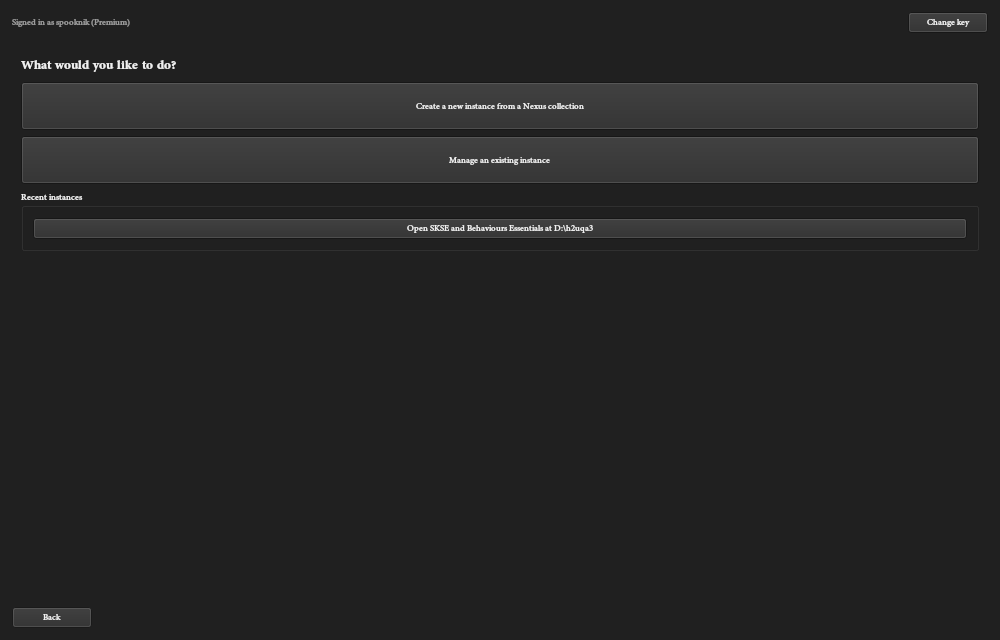
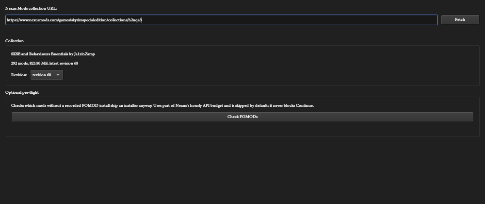
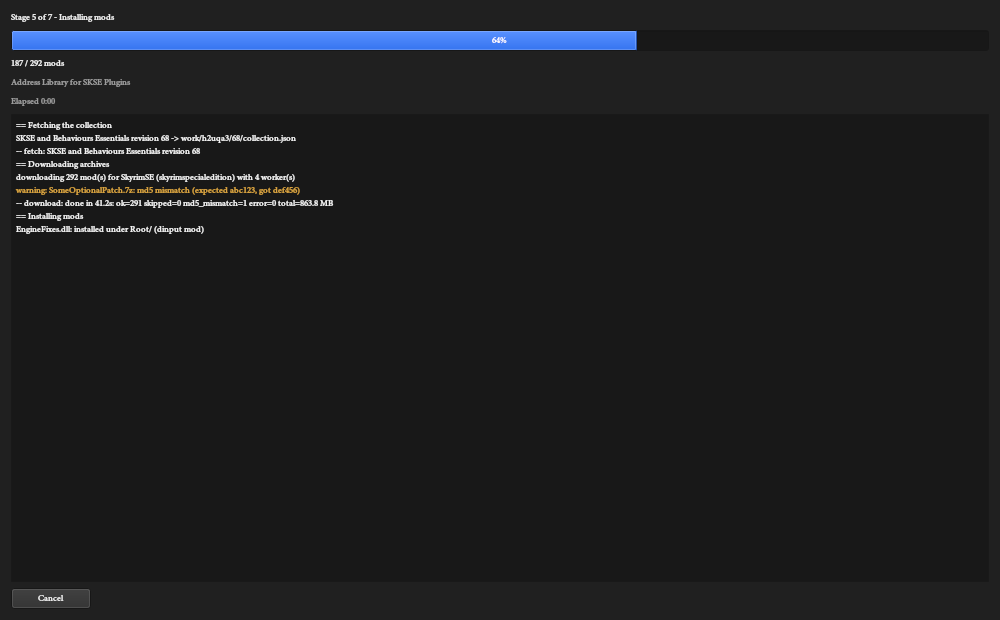
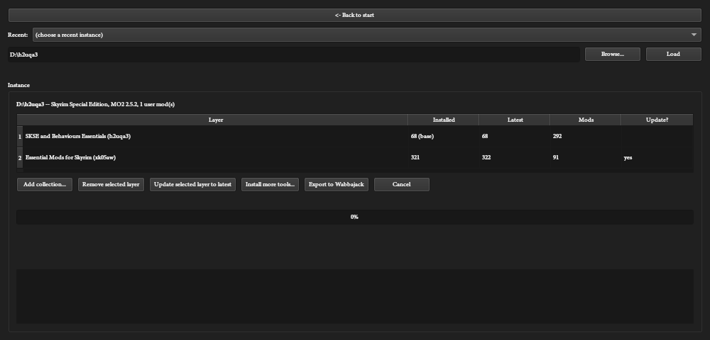

# collections2wabbajack

Turn a Nexus Mods collection into a working Mod Organizer 2 instance, without Vortex,
in one command or one guided GUI wizard - and optionally export it as a `.wabbajack`
modlist for others to install.

`collections2wabbajack` (`c2wj`) downloads a collection's manifest, downloads every mod
it references, replays the curator's recorded FOMOD choices, applies the curator's mod
order and rules, merges the collection's INI tweaks, and lays it all down as a
self-contained, portable MO2 instance - with the game copied into a `Stock Game` folder
so nothing a collection does can ever touch your real Steam install.

## Screenshots

| Home | Collection |
| --- | --- |
|  |  |

| Progress | Manage |
| --- | --- |
|  |  |

## How it works

1. **Fetch** - download the collection's manifest (`collection.json`) from Nexus Mods.
2. **Download** - fetch every mod archive the manifest references, MD5-verified,
   using your Nexus Premium key.
3. **Inspect** - open each archive to find FOMOD installers and work out its layout.
4. **Install** - build every mod's folder: replay the curator's recorded FOMOD
   answers, apply exact file lists for "replicate"-mode mods, and route game-root
   files (SKSE, DLL shims, engine patches) through Root Builder.
5. **Profile** - order mods by phase and the curator's rules, write
   `modlist.txt`/`plugins.txt`/`loadorder.txt`, and merge in the collection's INI
   tweaks plus your resolution/vsync/window choice.
6. **Build** - lay down a portable Mod Organizer 2 + Root Builder, copy the game into
   `Stock Game`, and point MO2 at the copy.

From there you can install optional tools (xEdit, LOOT, DynDOLOD, ...), layer more
collections on top, update a layer to a newer revision, or export the finished
instance to a `.wabbajack` modlist.

## Requirements

- Windows 10 or 11.
- A Nexus Mods account with a personal API key (Account Settings -> API Access).
  **Nexus Premium is required for automatic downloads** - the API only issues direct
  download links to Premium accounts. A free account can still fetch a collection's
  manifest and browse it.
- A Steam copy of the game the collection targets. Tested end-to-end on Skyrim
  Special Edition; other Bethesda games (Skyrim, SkyrimVR, Fallout 4, Fallout New
  Vegas, Fallout 3, Oblivion) are mapped but not verified.
- Free disk space: roughly the collection's download size, plus the same again for
  the extracted mods, plus about 20 GB for the `Stock Game` copy.
- [Wabbajack](https://www.wabbajack.org/) only if you want to export a `.wabbajack`
  - `c2wj wabbajack` will download `wabbajack-cli` itself if it isn't already
    installed.
- A short install path (e.g. `D:\GTS`, not `C:\Users\...\Documents\My Modding
  Projects\...`) - Windows' 260-character path limit is real with a 2,000-mod
  instance.

Running from source with `uv` for now; there's no signed release build yet, so
Windows SmartScreen may warn on a future packaged `.exe` until code signing is set up.

## Quick start: GUI

```
uv sync
uv run c2wj-gui
```

The wizard: paste your Nexus API key (stored in Windows Credential Manager, never
sent anywhere but Nexus) -> paste a collection URL -> pick an install folder and your
game folder (Steam installs are auto-detected) -> pick optional tools -> pick display
settings -> review -> Start. The **Manage** tab (from the home screen) reopens an
instance you already built: add or remove a collection layer, update a layer, install
more tools, or export to Wabbajack.

## Quick start: CLI

```
uv sync
cp .env.example .env      # paste your personal Nexus API key into .env

# Build a complete instance in one step
uv run c2wj create https://www.nexusmods.com/games/skyrimspecialedition/collections/h2uqa3 \
    --out "D:/h2uqa3" --game-path "D:/SteamLibrary/steamapps/common/Skyrim Special Edition" \
    --stock-game

# Install optional modding tools
uv run c2wj tools install xedit bethini-pie loot --mo2-dir "D:/h2uqa3"

# Layer an add-on collection on top
uv run c2wj add https://www.nexusmods.com/games/skyrimspecialedition/collections/xk05aw \
    --instance "D:/h2uqa3"

# Move a layer to its latest published revision (only the delta is re-downloaded)
uv run c2wj update --instance "D:/h2uqa3" --yes

# Export to a .wabbajack modlist
uv run c2wj wabbajack --instance "D:/h2uqa3"
```

See [`docs/cli.md`](docs/cli.md) for every subcommand and option.

## Verified

Built and confirmed working end to end on:

- **SKSE and Behaviours Essentials** (292 mods) - builds, opens clean in MO2 2.5.2,
  every plugin in the curator's load order present.
- **Gate to Sovngarde V117** (1,966 mods, 58.6 GB) - builds, opens clean in MO2 2.5.2,
  launches through SKSE, every plugin in the curator's load order is present, and the
  exported `.wabbajack` (809 KB) installs cleanly with Wabbajack 4.2.2.1.

## Terms and etiquette

- Converting a collection for your own use is fine.
- **Publishing a compiled `.wabbajack` of someone else's collection requires that
  curator's permission.** Community conversions of Gate to Sovngarde, for example,
  obtained it first - do the same.
- `c2wj` identifies itself to Nexus Mods with its own User-Agent, honours Nexus's
  rate limits, and only ever downloads with your own Premium key - it does not proxy,
  cache, or redistribute anyone's files.
- Whatever you build is yours to use. The collection's content - the mods themselves -
  still belongs to their authors and to the curator who assembled the list; this tool
  just automates the install.

## FAQ

Full answers in [`docs/faq.md`](docs/faq.md). Short version:

- **My resolution/vsync setting was ignored.** Some collections ship SSE Display
  Tweaks, which overrides `SkyrimPrefs.ini` entirely. Set it in the wizard, or
  `c2wj profile-instance --resolution WxH`.
- **MO2 shows `SkyrimRuntimeSwapper.exe` when I launch SKSE.** By design on
  collections that need a specific game version - it downgrades at launch and
  reverts on exit.
- **First MO2 start takes a minute or more.** It's indexing a couple thousand mods.
  Normal.
- **xEdit/DynDOLOD only see vanilla plugins.** Run `c2wj tools refresh` on instances
  built before this was fixed.
- **"Path too long" errors.** Install to a short path.
- **"A required patch is missing" from the Runtime Swapper.** Your `Stock Game` copy
  isn't the exact game version the collection expects.
- **I'm not Premium - now what?** Automatic downloads won't work yet; manual-download
  support isn't implemented.
- **Can I add my own mods?** Yes - they keep their position across `update`/`add`/
  `remove`.
- **A FOMOD mod took the installer's defaults.** "Fresh install" mods (no recorded
  choices) do that by design, and it's called out in the run's log.
- **Where's my API key stored?** Windows Credential Manager for the GUI, `.env` for
  the CLI. Never printed, never committed.

## Status and limitations

- Windows only.
- Nexus Premium required for automatic downloads; manual-download mode isn't
  implemented.
- Vortex "replicate"-mode `patches` (binary diffs against an existing file) aren't
  implemented - collections that use them will warn, not fail.
- Verified end to end on Skyrim Special Edition only. Other Bethesda games are mapped
  in the code but untested.
- No signed release binary yet - run from source with `uv`.

## Licence

[GPL-3.0-or-later](LICENSE). Not affiliated with Nexus Mods, Mod Organizer 2,
Wabbajack, or any collection curator.

## Credits

- [Mod Organizer 2](https://www.modorganizer.org/) and
  [Root Builder](https://www.nexusmods.com/skyrimspecialedition/mods/62435) by Kezyma
- [Wabbajack](https://www.wabbajack.org/)
- [7-Zip](https://www.7-zip.org/)
- The [xEdit](https://github.com/TES5Edit/TES5Edit) team
- [DynDOLOD](https://dyndolod.info/) by sheson
- The Nexus Mods collections and modding community
- Inspired by [Furglitch's MO2 nxm-collection-dl plugin](https://github.com/Furglitch/modorganizer2-nxm-collection-dl),
  the starting point for this project's investigation into converting collections
  outside Vortex

For development docs (architecture, tests, linting, the `work/` layout), see
[`docs/development.md`](docs/development.md) and [`CLAUDE.md`](CLAUDE.md).
